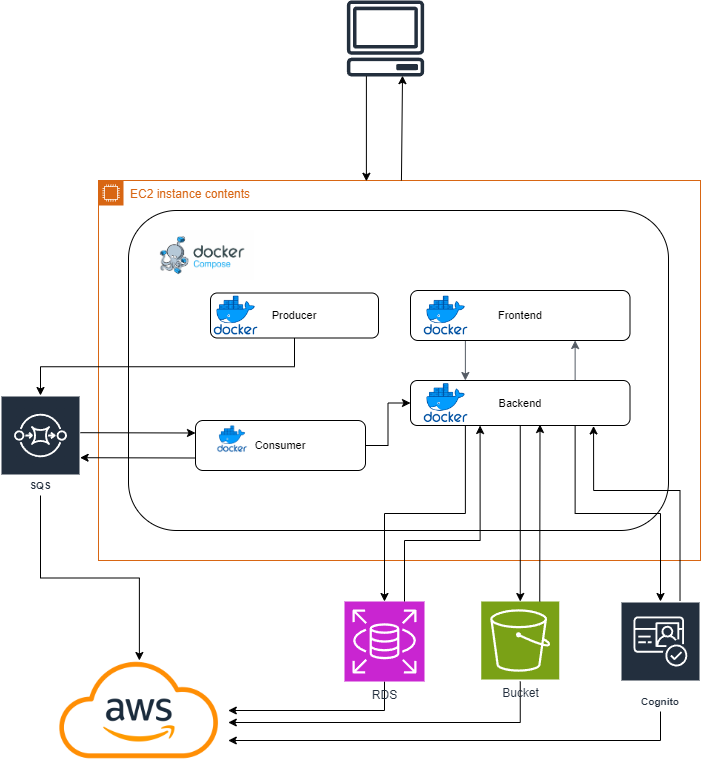
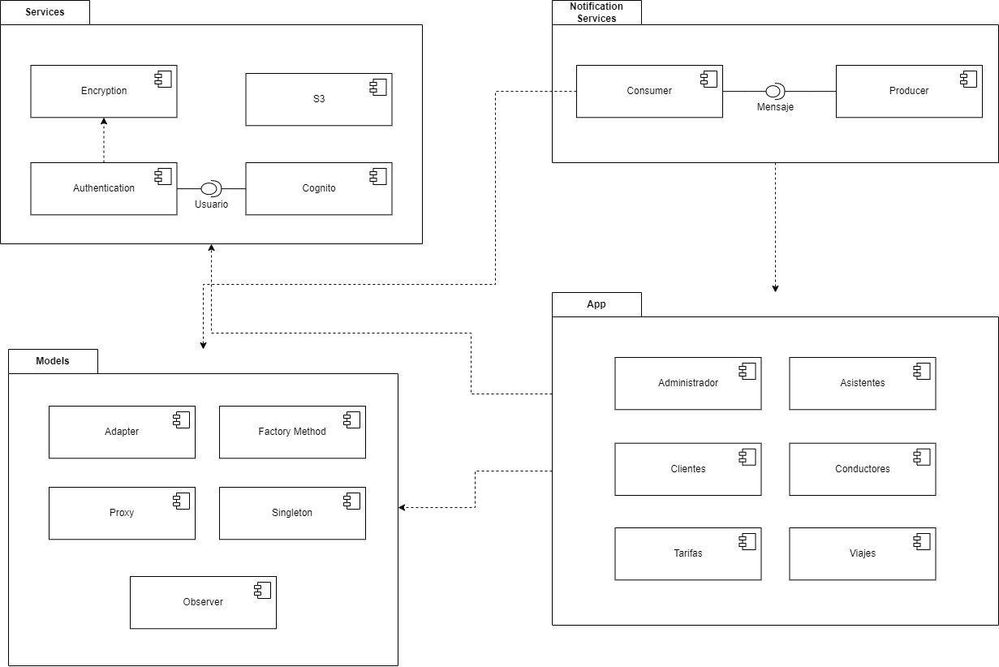

[REGRESAR](../../README.md)

#   ARQUITECTURA DEL SISTEMA

##  [Diagrama de despliegue](https://viewer.diagrams.net/?border=0&tags=%7B%7D&lightbox=1&highlight=0000ff&edit=_blank&layers=1&nav=1#R%3Cmxfile%3E%3Cdiagram%20name%3D%22Page-1%22%20id%3D%22p6Zi1pGUybGFfBXznAiu%22%3E7Vxbd6M4Ev41fjQHiftj7MTbe7ZnTiZ56OmnPsQoNt0YeQHHyfz6kUACJGGMLwSn474kViEJoaqvqlRVeGRMV6%2F%2FSfz18g8coGgE9eB1ZNyOIASOZ5BflPJWUDzbKgiLJAxYp4rwGP6DGFFn1E0YoFTomGEcZeFaJM5xHKN5JtD8JMFbsdszjsS7rv0FUgiPcz9Sqd%2FCIFsWVNfSK%2FoXFC6W%2FM5AZ1dWPu%2FMCOnSD%2FC2RjLuRsY0wTgrPq1epyiim8f3pRg323G1XFiC4qzLAPjwx%2BzP%2F%2F31I3n4svFx4s8eft6PnWKWFz%2FasAdmi83e%2BA6kv1A2p4%2Bij4wJ3mRRGKNpuduU%2BIzjbIojnOQDDPJ3RpcwWSR%2BEKLqWoxjRLuHUSR3vyX0NEvwLyR1Dvx0iQJ2oxeUZCHhzVf%2FCUX3OA2zEMfk2hPOMryqdbiJwgW9kOE1ofqsNSdrQWTuyTJbRaQN2NqZ1AHI2%2Bzh6S39dF086HP4StcxWeOQznL3QiZL2SSEtWs6YPW6oCjQ%2FG1qavMozDkzYVtMloZed%2FIOlBJBoITwCmXJG%2BnCBpi6XQxhKOLit61E0nEL0rImjQ4b5TMQLMqJKzkhH5ioHCI2jiImKCC4YU2cZEu8wLEf3VXUcpcYVCmXJwnexEHJ32rcV0w5l2%2FuT5Rlb4xF%2FibDIv%2FQa5j9TYdrFmt9r125fWUz5423WuMeJSHZCyoOOU0UvgA9%2B5soa5IdWcRWYRDkj0clZ%2Bavwoje5guKXhDtJ4kYkOBS3SiiMj3x578W%2BZ6oHVAc3FCFRhcT%2BWkazkvZont%2FqGQlKPKz8EUc1yQobOg9lftKIi3H0xxLEErHkGZJ8SaZIzawrpmkuaDraFx8%2BVwOFOfK%2FGSBMmUusiP%2BW61bjs60Zdmu3nifCgzFjBU0yi07Hi0AKFp2spkTtdqua9mzkAvWhPwjC58W%2Fy3SdUopGrQaiE00RyUCtRv5BZruIBObaI5KBGo32uKrFolNNMdSVyyPBg2jgTTauj3UdEk2yrm5AcBW1AS58pz%2FuURD1WiUElSA8r9zup4JaRafxF6pcR6zZZm6rCRsC3QzXW5fpsu%2Bmq4PZboIq3KRbVOwzFgURqKlo%2BGeaAxPEj2%2BzJodeLh9vBqBD2IEph60Cnf%2FUxiBJEjPdXgx95oA7pbVTQCnnR%2BHtoLDuyklhHGa%2BTFRNXk8IUPMlRTQ2QhIBYwyEBUQigBUhFsWbEWoRXgpCJRhqmBZhLuCOBmWCnZbAbXj4F8T5O0yzNDj2s%2FV%2BpYIXQfhpizxyb0SNod8Ei%2F6RJG%2FTsOnclSC5pskJbr9AaXF5PouXFDztc6X34SH%2FOoPNIc%2FuJj8KIWkQSfcurYNDEmLsI1oB36EnqnRTMnuhPHia966NRoUVXkLQe2cAbHAEk9j0FDjDbYOVcgavWEWqphVoFl5ZLtETFKlffo8ndjQop52MscQT7ANrCFudwNrYF%2Bs4cf%2BHR41k%2FmeXWh4gA8dk6euj6Lt7%2FWL1bi8xQcqGLdMa2Kbv4Wr3Woo9zrg0OnogMNBHXCohrtnSa7Dg8%2BqTPiZhGkTAFR1AoGnWapCsXrTJ7rCjPfXJ05dn%2Bhd9Ykj6BNw1SfH6hO3qz5xBtUnrqJP6F5e1UnpOOqd1Ylp9aVOuuQ4mTIJV3k6eP%2FRfe8W73Dx5fN5fsMbTtU5hXxeZhlNcd%2FQhyePjYLQ17bhr3C8xluUaHOyDDgLVwvyE%2BoQ6AA4wNA9aGk%2F14s%2BeWyJLG5IRQLd1IDzjhbDVANrH4%2FFEbFV6XiLkyjQYpobmm3XY3bCJI3NOsJ%2BkDJ2k1%2F0%2FDW7xUTdJOPHt9UTjrR13CvnVWfBUnjvAI2nuwR098Z648r6AVhPFqINz3xLZf59goPNnPhMn9MAAwWiTXwCdkPGrTcD7LTHBwbIuPHPuW9fZt%2F2efdCqEArPf1Ozv3vlJU7zbW3zI6ufaHZh3Lt%2BTJrqmWK43Sz%2BrSqxXNEC2A2OH5OQ%2BCxN6%2FPsq6m%2Fx1MP9Blk3IBhr9DNuDK%2BjN4E2KuofQRaqw33UbWQ0fT%2B6o%2BNdSwyyfgvkuLE1f%2BPzgef0NP40eUvIRzlI5vvj2Ov5LJDhGGPek%2Fie1OQ1AYOFXNZp3vZf37%2BTGvxnEe%2F9pTPXOOcvXd1R5Nhex0ok5VIKWbJ8tVKZFthSD78uf8ObmTnZetFAll0jJGOzLg6%2Fz0lLHCkHVjHjz9f9rmxpzHQWkXUFuUT7NBLTUVlPQom16Dt7iIQ3IAucrnO8vnnG380DIqVZp3rXoqle%2FZhdRuz6tdeOXr73ue7lrlyqNde0%2FO1qBJMf6C3wDp2w8qI%2FUqFkMITXme3R6caigHr6WjqWEUgla6DveErfKWPOUZhbhrociuk8mJry0Z%2FKjAXQdDinp2fWfJ8ET1DjxJbe94Yelc7xTZ7a8xXFGmoqxWpgFFWHiuNzAsePh0Ly5OVe07XovTJWm29eNgYdpSnkgOAfUNi%2FYXU6%2BwaIGFiAm4L8FRWS3P8wSrZRT4OshqndNP6mpjihj%2F2cEEpApdC5qaA0zoWsVP910R4RiDIeLq5h8jvp1r38Cpb3afltU1L%2B80eUAR%2BFXOussZHFTO2o%2BTg8iZc5WzHuSsCKIOJmfupcjZVWR4OL3%2F97l3HIekw71jeMcdh6Anfa2JbXRy%2Fg79WhMHSgv2hO%2BC6udrTdyLiSdfEdP5zNMTYiCP%2BpZV4VYnQVcPT5bePtEO6J1NqId7mfGDSnHpFgkxAKdrVaXmeVKQ2oZDB6k71yienGn53dEEL8VEHPVm3wdGZEtWyABOHXD73lLsPfQNO4Lt5HeHdzh7hgg20z0yJWRytcEz%2Fra0ljM5e6Yt3scSnT31AU29rX9PzmF7eOjiXuL9qFCvYG15I8GMeuREewSyew7O81rRwdAuHe2ORrs8UVe0nw1gFxMX%2B%2FjQcQ1TsIiaDo6yijXNY5o11TOmlRc8RzZMTqxrRKUn2LlSgMI2jkwwO8ZxsDs4oiIbTbPdyNq8Oqu5%2F6FGdkS%2FmIR%2FM3jRvfp%2BdePuXw%3D%3D%3C%2Fdiagram%3E%3C%2Fmxfile%3E)

Este diagrama muestra cómo los diferentes componentes del sistema están desplegados en la infraestructura física y en la nube. 

## Selección del estilo arquitectónico

Este diagrama ilustra cómo los servicios se comunican entre sí, resaltando la independencia de cada componente.

####  Frontend: 

- **React App**: La interfaz de usuario que interactúa con el User Management API para manejar tanto la gestión de usuarios como la de métodos de pago, gestión de viajes y reportes. 

#### Backend: 

-   **User Management Service (Flask)**: Ahora gestiona tanto las operaciones de usuario como la gestión de métodos de pago, interactuando con dos bases de datos MySQL (User DB para información de usuarios, gestión de viajes y data necesaria para los reportes). 

-   **Auth Service (Node.js)**: Maneja la autenticación y validación de tokens utilizando AWS Cognito. 

-   **Notification Service (Node.js)**: Maneja las notificaciones utilizando el patrón Observer con AWS SQS. 

#### Comunicación: 

-   **Servicios Desacoplados**: El User Management API ahora centraliza tanto la gestión de usuarios como la de métodos de pago, gestión de viajes y reportes, mientras que el servicio de autenticación y el sistema de notificaciones permanecen como componentes independientes. 

## [Diagrama de componentes](https://viewer.diagrams.net/?border=0&tags=%7B%7D&lightbox=1&highlight=0000ff&edit=_blank&layers=1&nav=1#R%3Cmxfile%3E%3Cdiagram%20name%3D%22Page-1%22%20id%3D%22IRfEjn1NqeEmFRyOKvEi%22%3E7Vxbc9o4FP41eYRBlq%2BPCU22nWl3M2W32zztCCxArbFcWQTIr1%2FZli8gG0xJQEzMQ2Id5Ns537nqiBs4XKz%2FYCiaf6E%2BDm6Mgb%2B%2BgR9uDMMYmJ74l1A2GQWAAcwoM0Z8SSsJI%2FKCJXEgqUvi43hrIqc04CTaJk5oGOIJ36Ihxuhqe9qUBtt3jdAMK4TRBAUq9V%2Fi83lGda1BSf%2BIyWzOi%2FeT3yxQPlkS4jny6apCgvc3cMgo5dnRYj3EQcK9nC%2FZeQ8N3xYPxnDI25xw%2F7QJez%2F%2F%2B7Xxv1K4ih7NJ%2FelB6zsMs8oWMo3HmH2TCaC59lT803OCvECUXKY8BCzG3g3pSEfye%2BBGHM0znkk%2BJARCuZASXikMeGEhoIU4Kn45m7OF4G8wpguQx%2F7n8c5IUBjHHwKP2KU3jKlCVFzRMLKOAhQFJNx%2BiDJbVZzwvEoQpOEsBLIFDT5nphxvG7kICjkIhCN6QJzthFTCjhnZ0gsQzlclbiw8inzCiZgDgkksTgrrlyKSxxIiR0jPVuRniK1CndjzuhPPKQBTVgX0lBMuWM4FkpXyK2gFIJLSFMSBDvnCbbxUiCJ7qFSACgI6Oo2V7%2BEIgwDrs74bRHtgbEquEOiKcwMwwHi5Hlb6evkJe%2FxSIl4IAUK%2BRl0Oo0xV%2BRbPNnvi9xWRf5PvESM0EZ9jRh9FkbU%2F4p%2FLQnD%2FqeQYzZNOV%2FVvYTvRBi%2Bz4nKVbR0TDmniwQ%2BPzGfzKX8Xl9WuZKZTt8aDAB05cfcUjrx6QNTUTzD7LuGXZzjunaNsN9KDVUbOqSzkHBVJBV2%2B4xGfyM2w%2FysGrHOAWv0rS3GAs%2Fre54DTOHc0r%2BuwmTg1qiQbfbzM9K%2F3hsxuYWpywG%2FoP4yod39wJxvctPm5oTCspkncXg%2Fg4EK0Tr7c6L5kTfrGc6WLJ2zWSNXEQL2Rfwkh5TxOZ3REAX3JfWOZU5ewr6c85nSSCpHKicZDKKlUKQtS4XXhH%2BvHD8llxJwzkYf1vLK6WBTGTxiRsQbp4FDSgv91EeVTk1QHkjCgoqNS17od3RPcIUu2QS3MOY8twNHYq01bE7TPO%2BSQi4F%2B1SVa62QfRTP03uCc0gPthSed0nhQcVs3i75XHBAuPrUwevropxaD1XxNWoYcFEPZermoWDnoXq2cxHjFYqn%2Fl64GTGo%2BKhkWNqvdLSpjrRzU20NXebOLmXpPEX97sMJ20RXZuUcvY1cnjDrY%2BUa3Ou7snKOIpQR1BjzSvLp7uSetl6gd3XDvNNhvmerQrhYWpJ%2F0z73PDZVAS19NXBaOmvYgKHzOGugWqw%2FKSfTIisZdMsQTertDA6vQ1i1Cv9m6xAtDOT7WIdoUKpDogHmta1DWGq4%2FQWHMfqBGxVWt3WI%2FU7UsGHfMoFdfOCW0gERwwDoVT6q0zX6XuV82zabnfDrq6QqnyEN4%2BVC2KsLBob7eQ63DZuj94qEoV0qBLpcSMSFA0UK54wLdV2TyOtghwLI3LAfDCCbwHaeADK%2FcEX5HplQsonW9s26LgNn6GbgDkTG78TAAUUKZylp7zdMr7Uoq4%2BBawLbibixd9rIdkPA7AXkSa%2BPHkPNvNO2zS7RPhSOmraaaJt19hl6bxXVG12iXUXx3kS7VjSGA08z%2FmdPtA01kbv1UcQvGuc0sV9eZifMsfUOc6B2eZzR5XFCLGqE%2F4AmnKac%2BIJFAOPrqwGGfV0qoF2kD7tIXzBB7d4akXAmHOtFWxqOxD6wt1saLM2wr1%2FfVte49dJzVK%2F81zjG7FnnwAfsRD673TyaQd9RXeyFoe8M9vP3XUAfqhtKHhldb%2FTFvXVdFl%2B7vSSw20zy0rMu06pbt3DTWLVMmHzehh7YtqGnSUXPtM9ALSveRlGjWr3bmqLSvOOpRcXaFhETvFVREXZFxf0tcQcbq1znNMt79qIirCsqLkhIhHCRTy8ZYTcJIdef2n75Ssyg9uFcdlOQdsVF2BUXhVjUzOc2FugXrKtpOdUG%2FYa32zmvO%2FwN3eBvdoVFwQS1sDikob9MyuvXhX%2FgWn0HVFJNQzMF0K66aHbVRcGEmt%2FsCIjm1l%2BJfbQHv3aFFrMrtAgmqLm6ADWZomvCfrZnsERxzj5tsK%2FdpkGz2zUomKBmvt8I%2BqGz2VeDHt2xb2mX9Jpd0vvSyzcg6VxgB0beMqxdgb1pV%2FtxcLhlDG0qE6IEHHEzWuydgrElV9MeWs43zcHe%2BYa7d744yJ74dRf3VXtwBiS%2B2Z7r1h3lpy7RNIh8p1F5t%2F24oaP8aCTu3AbI4k4jEnfmQ%2FcAEp29849FohiWP66bTS9%2Foxje%2Fw8%3D%3C%2Fdiagram%3E%3C%2Fmxfile%3E)

[REGRESAR](../../README.md)