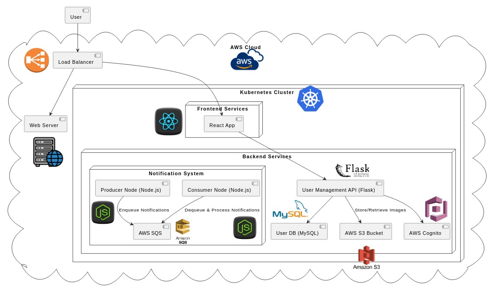
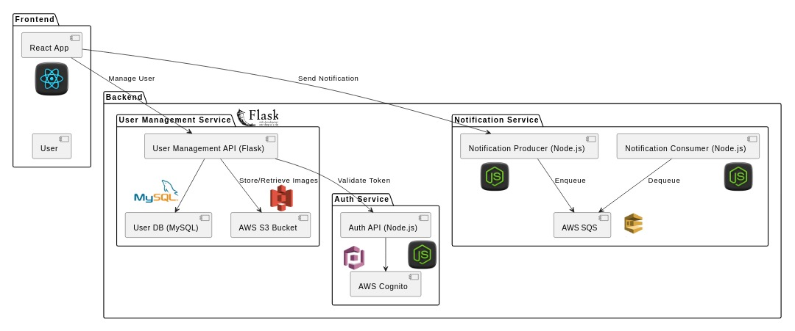
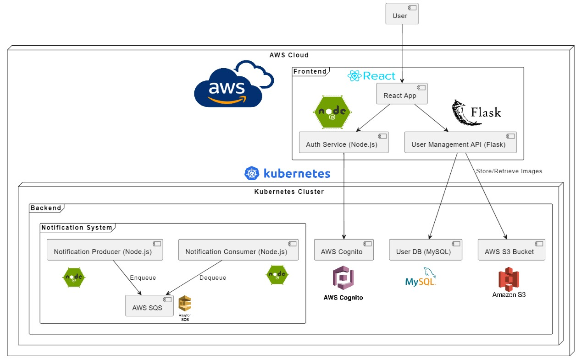

[REGRESAR](../../README.md)

#   ARQUITECTURA DEL SISTEMA

##  Diagrama de despliegue de la arquitectura 

 

-   Este diagrama muestra cómo los diferentes componentes del sistema están desplegados en la infraestructura física y en la nube. 

## Selección del estilo arquitectónico

-   Este diagrama ilustra cómo los servicios se comunican entre sí, resaltando la independencia de cada componente en la arquitectura de microservicios. 

###  Arquitectura de microservicios 

####  Frontend: 

- **React App**: La interfaz de usuario que interactúa con el User Management API para manejar tanto la gestión de usuarios como la de métodos de pago, gestión de viajes y reportes. 

#### Backend: 

-   **User Management Service (Flask)**: Ahora gestiona tanto las operaciones de usuario como la gestión de métodos de pago, interactuando con dos bases de datos MySQL (User DB para información de usuarios, gestión de viajes y data necesaria para los reportes). 

-   **Auth Service (Node.js)**: Maneja la autenticación y validación de tokens utilizando AWS Cognito. 

-   **Notification Service (Node.js)**: Maneja las notificaciones utilizando el patrón Observer con AWS SQS. 

#### Comunicación: 

-   **Servicios Desacoplados**: El User Management API ahora centraliza tanto la gestión de usuarios como la de métodos de pago, gestión de viajes y reportes, mientras que el servicio de autenticación y el sistema de notificaciones permanecen como componentes independientes. 

##   Diagrama de implementación (despliegue y componentes) 

-   Este diagrama combina el despliegue físico y los componentes lógicos, mostrando cómo están organizados e implementados en el entorno. 

[REGRESAR](../../README.md)