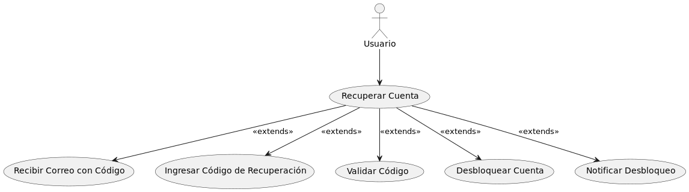
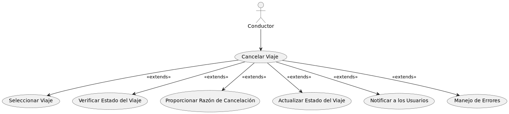
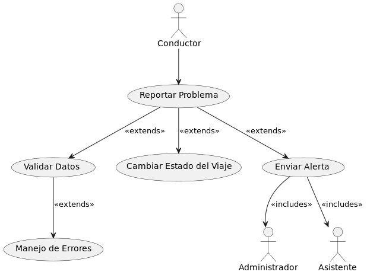
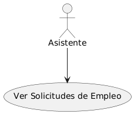
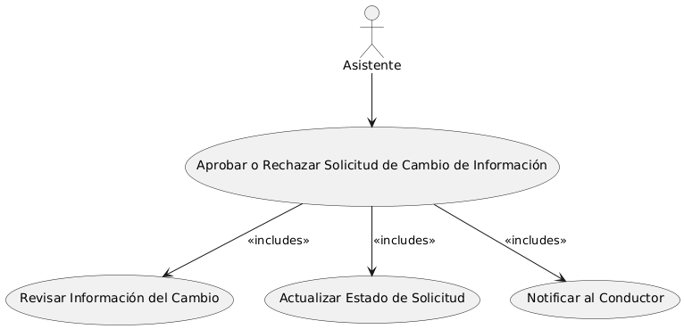
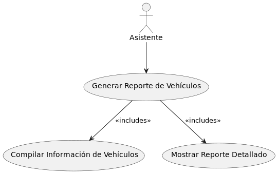
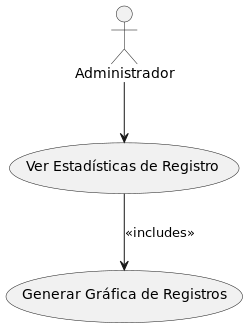
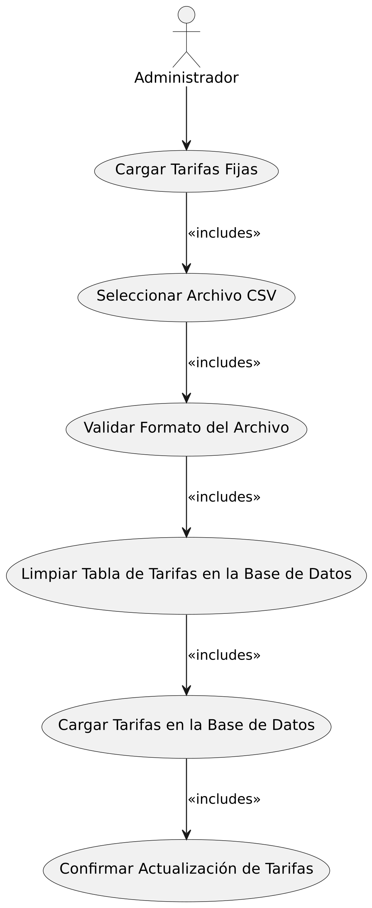

# CASOS DE USO EXTENDIDOS Y DE ALTO NIVEL

## Caso de Uso: Registro de Clientes

| **ID Caso de Uso:** | CU 001 |
|---------------------|--------|
| **Módulo al que pertenece:** | Autenticación y registro |
| **Actor Principal:** | Cliente |
| **Precondiciones** | - El cliente debe tener acceso a la plataforma "Qnave".   - El cliente debe contar con una dirección de correo electrónico válida y acceso a internet. |
| **Postcondiciones** | - Se crea una cuenta de cliente en la plataforma "Qnave".   - El cliente recibe un correo electrónico para verificar su cuenta.   - Los datos personales del cliente son almacenados de manera segura y encriptada en la base de datos. |
| **Escenario Principal** | 1. El cliente accede a la plataforma "Qnave" y selecciona la opción de registro.   2. El cliente completa el formulario de registro ingresando su nombre completo, fecha de nacimiento, género, correo electrónico, número de celular, contraseña, confirmación de contraseña, y pregunta de seguridad.   3. El cliente sube una fotografía de su DPI.   4. El cliente selecciona sus métodos de pago preferidos (opcional).   5. El sistema valida que todos los campos cumplan con el formato y tipo de dato requerido.   6. El sistema encripta los datos sensibles (contraseña y métodos de pago) utilizando SHA-256.   7. El sistema almacena la información del cliente en la base de datos.   8. El sistema envía un correo de confirmación al cliente para verificar su cuenta.   9. El cliente recibe el correo y verifica su cuenta. |
| **Escenario Alternativo** | 1. Campo inválido: Si algún campo no cumple con el formato requerido, el sistema muestra un mensaje de error indicando el problema y solicita la corrección de los datos.   2. Correo electrónico duplicado: Si el correo electrónico ya está registrado, el sistema muestra un mensaje de error y solicita el uso de un correo electrónico diferente.   3. Error en la carga del DPI: Si la fotografía del DPI no se carga correctamente, el sistema solicita al cliente que intente nuevamente.   4. Verificación no completada: Si el cliente no verifica su cuenta mediante el correo electrónico, no podrá acceder a la plataforma. |
| **Requerimientos especiales** | - Todos los datos sensibles deben ser encriptados antes de ser almacenados.   - La plataforma debe estar preparada para manejar errores de carga de imágenes y validación de datos en tiempo real. |
| **Sistema:** | Qnave |

---

---

## Caso de Uso: Registro de Conductor

| **ID Caso de Uso:** | CU 002 |
|---------------------|--------|
| **Módulo al que pertenece:** | Autenticación y registro |
| **Actor Principal:** | Conductor |
| **Precondiciones** | - El conductor debe tener acceso a internet.   - El conductor debe contar con la papelería necesaria en formato digital (CV en PDF, fotografías en PNG/JPG).   - El conductor no debe estar registrado previamente en la plataforma. |
| **Postcondiciones** | - Se crea una cuenta para el conductor en la plataforma.   - Se genera un código de empleado y una contraseña temporal para el conductor.   - La solicitud de registro queda pendiente de aprobación por parte de un administrador. |
| **Escenario Principal** | 1. El conductor accede a la página de registro en la plataforma.   2. El conductor completa el formulario de registro, ingresando la siguiente información:   - Nombre completo   - Número de teléfono   - Edad   - Número de DPI   - Correo electrónico   - Subir papelería (CV en PDF)   - Subir fotografía personal   - Subir fotografía del vehículo   - Placa del vehículo   - Marca del vehículo   - Año del vehículo   - Género   - Estado civil   - Número de cuenta   - Dirección de domicilio   - Contraseña   - Código de empleado (generado automáticamente)   - Pregunta de seguridad   3. El sistema valida que todos los campos cumplen con el formato y tipo de dato requerido.   4. El sistema encripta la información sensible (SHA 256).   5. El sistema genera un código de empleado y una contraseña temporal.   6. El sistema envía un correo electrónico al conductor con el código de empleado y la contraseña temporal.   7. La solicitud de registro es enviada a un administrador para su aprobación. |
| **Escenario Alternativo** | 1. Error en la validación de los datos: El sistema detecta errores en la información proporcionada.   2. El correo electrónico ya está registrado: El sistema detecta que el correo electrónico ya existe en la base de datos.   3. Problemas en la generación del código de empleado o contraseña: El sistema no puede generar el código o la contraseña. |
| **Requerimientos especiales** | - Encriptación de datos sensibles (SHA 256).   - Generación automática del código de empleado y contraseña temporal.   - Envío de correo electrónico al completar el registro. |
| **Sistema:** | Qnave |

---

---

## Caso de Uso: Iniciar Sesión

| **ID Caso de Uso:** | CU 003 |
|---------------------|--------|
| **Módulo al que pertenece:** | Autenticación |
| **Actor Principal:** | Cliente |
| **Precondiciones** | - La cuenta del cliente debe estar validada. |
| **Postcondiciones** | - El cliente ha iniciado sesión exitosamente en la plataforma. |
| **Escenario Principal** | 1. El cliente ingresa su correo electrónico y contraseña.   2. El sistema valida las credenciales.   3. El cliente puede acceder a los módulos disponibles. |
| **Escenario Alternativo** | 1. Si las credenciales son incorrectas:   - El sistema permite hasta 5 intentos.   - Tras 5 intentos fallidos, se bloquea la cuenta y se inicia el proceso de recuperación de cuenta, notificando al cliente por correo electrónico. |
| **Requerimientos especiales** | - La contraseña debe ser encriptada antes de su almacenamiento en la base de datos.   - Implementar un mecanismo de recuperación de contraseña. |
| **Sistema:** | Qnave |

---

---

## Caso de Uso: Recuperar Contraseña

| **ID Caso de Uso:** | CU 004 |
|---------------------|--------|
| **Módulo al que pertenece:** | Autenticación |
| **Actor Principal:** | Cliente |
| **Precondiciones** | - El cliente debe haber iniciado el proceso de recuperación de contraseña. |
| **Postcondiciones** | - El cliente ha restablecido su contraseña y puede iniciar sesión nuevamente. |
| **Escenario Principal** | 1. El cliente solicita la recuperación de contraseña.   2. El sistema envía un enlace de recuperación al correo electrónico del cliente.   3. El cliente sigue el enlace y crea una nueva contraseña.   4. La nueva contraseña es encriptada y almacenada en la base de datos. |
| **Escenario Alternativo** | 1. El enlace de recuperación expira o es inválido:   - El cliente debe solicitar un nuevo enlace de recuperación. |
| **Requerimientos especiales** | - El enlace de recuperación debe tener un tiempo de expiración.   - La nueva contraseña debe ser encriptada. |
| **Sistema:** | Qnave |

---

---

## Caso de Uso: Iniciar Sesión

| **ID Caso de Uso:** | CU 005 |
|---------------------|--------|
| **Módulo al que pertenece:** | Autenticación |
| **Actor Principal:** | Conductor |
| **Precondiciones** | - La cuenta del conductor debe estar validada. |
| **Postcondiciones** | - El conductor ha iniciado sesión exitosamente en la plataforma. |
| **Escenario Principal** | 1. El conductor ingresa su código de empleado o correo electrónico y contraseña.   2. El sistema valida las credenciales.   3. El conductor puede acceder a los módulos disponibles. |
| **Escenario Alternativo** | 1. Si las credenciales son incorrectas:   - El sistema permite hasta 5 intentos.   - Tras 5 intentos fallidos, se bloquea la cuenta y se inicia el proceso de recuperación de cuenta, notificando al conductor por correo electrónico. |
| **Requerimientos especiales** | - La contraseña debe ser encriptada antes de su almacenamiento en la base de datos.   - Implementar un mecanismo de recuperación de contraseña. |
| **Sistema:** | Qnave |

---

---

## Caso de Uso: Recuperar Contraseña

| **ID Caso de Uso:** | CU 006 |
|---------------------|--------|
| **Módulo al que pertenece:** | Autenticación |
| **Actor Principal:** | Conductor |
| **Precondiciones** | - El conductor debe haber iniciado el proceso de recuperación de contraseña. |
| **Postcondiciones** | - El conductor ha restablecido su contraseña y puede iniciar sesión nuevamente. |
| **Escenario Principal** | 1. El conductor solicita la recuperación de contraseña.   2. El sistema envía un enlace de recuperación al correo electrónico del conductor.   3. El conductor sigue el enlace y crea una nueva contraseña.   4. La nueva contraseña es encriptada y almacenada en la base de datos. |
| **Escenario Alternativo** | 1. El enlace de recuperación expira o es inválido.   - El conductor debe solicitar un nuevo enlace de recuperación. |
| **Requerimientos especiales** | - El enlace de recuperación debe tener un tiempo de expiración.   - La nueva contraseña debe ser encriptada. |
| **Sistema:** | Qnave |

---

---

## Caso de Uso: Iniciar Sesión

| **ID Caso de Uso:** | CU 007 |
|---------------------|--------|
| **Módulo al que pertenece:** | Autenticación |
| **Actor Principal:** | Asistente |
| **Precondiciones** | - La cuenta del asistente debe estar validada. |
| **Postcondiciones** | - El asistente ha iniciado sesión exitosamente en la plataforma. |
| **Escenario Principal** | 1. El asistente ingresa su código de empleado o correo electrónico y contraseña.   2. El sistema valida las credenciales.   3. El asistente puede acceder a los módulos disponibles. |
| **Escenario Alternativo** | 1. Si las credenciales son incorrectas:   - El sistema permite hasta 5 intentos.   - Tras 5 intentos fallidos, se bloquea la cuenta y se inicia el proceso de recuperación de cuenta, notificando al asistente por correo electrónico. |
| **Requerimientos especiales** | - La contraseña debe ser encriptada antes de su almacenamiento en la base de datos.   - Implementar un mecanismo de recuperación de contraseña. |
| **Sistema:** | Qnave |

---

---

## Caso de Uso: Recuperar Contraseña

| **ID Caso de Uso:** | CU 008 |
|---------------------|--------|
| **Módulo al que pertenece:** | Autenticación |
| **Actor Principal:** | Asistente |
| **Precondiciones** | - El asistente debe haber iniciado el proceso de recuperación de contraseña. |
| **Postcondiciones** | - El asistente ha restablecido su contraseña y puede iniciar sesión nuevamente. |
| **Escenario Principal** | 1. El asistente solicita la recuperación de contraseña.   2. El sistema envía un enlace de recuperación al correo electrónico del asistente.   3. El asistente sigue el enlace y crea una nueva contraseña.   4. La nueva contraseña es encriptada y almacenada en la base de datos. |
| **Escenario Alternativo** | 1. Si el enlace de recuperación expira o es inválido:   - El asistente debe solicitar un nuevo enlace de recuperación. |
| **Requerimientos especiales** | - El enlace de recuperación debe tener un tiempo de expiración.   - La nueva contraseña debe ser encriptada. |
| **Sistema:** | Qnave |

---

---

## Caso de Uso: Iniciar Sesión

| **ID Caso de Uso:** | CU 009 |
|---------------------|--------|
| **Módulo al que pertenece:** | Autenticación |
| **Actor Principal:** | Administrador |
| **Precondiciones** | - El administrador debe haber recibido un usuario y una contraseña encriptada. |
| **Postcondiciones** | - El administrador ha iniciado sesión exitosamente en la plataforma. |
| **Escenario Principal** | 1. El administrador ingresa su usuario y contraseña.   2. El sistema valida las credenciales.   3. El administrador es redirigido a una pestaña de verificación adicional. |
| **Escenario Alternativo** | 1. Si las credenciales son incorrectas:   - Se permite hasta 5 intentos.   - Tras 5 intentos fallidos, se bloquea la cuenta y se inicia el proceso de recuperación de cuenta, notificando al administrador por correo electrónico. |
| **Requerimientos especiales** | - La contraseña debe ser encriptada antes de su almacenamiento en la base de datos.   - Implementar un mecanismo de recuperación de contraseña. |
| **Sistema:** | Qnave |

---

---

## Caso de Uso: Verificación Adicional con Archivo

| **ID Caso de Uso:** | CU 010 |
|---------------------|--------|
| **Módulo al que pertenece:** | Autenticación |
| **Actor Principal:** | Administrador |
| **Precondiciones** | - El administrador ha ingresado el usuario y la contraseña en el paso anterior. |
| **Postcondiciones** | - El sistema verifica la autenticidad del administrador y concede el acceso si es válido. |
| **Escenario Principal** | 1. El sistema solicita al administrador que cargue un archivo de texto plano con extensión .ayd.   2. El administrador carga el archivo que contiene una segunda contraseña encriptada.   3. El sistema valida la información en el archivo con la base de datos.   4. Si la información es correcta, el administrador accede a los módulos disponibles. |
| **Escenario Alternativo** | 1. Si el archivo es incorrecto o no coincide:   - El acceso es denegado y se notifica al administrador. |
| **Requerimientos especiales** | - El archivo .ayd debe contener una contraseña encriptada.   - Implementar un mecanismo para verificar la autenticidad del archivo. |
| **Sistema:** | Qnave |

---

---

## Caso de Uso: Bloqueo de Cuenta

| **ID Caso de Uso:** | CU 011 |
|---------------------|--------|
| **Módulo al que pertenece:** | Autenticación |
| **Actor Principal:** | Sistema |
| **Precondiciones** | - El usuario ha fallado 5 intentos de inicio de sesión. |
| **Postcondiciones** | - La cuenta del usuario está bloqueada y se ha notificado al usuario sobre el bloqueo. |
| **Escenario Principal** | 1. El sistema detecta 5 intentos fallidos de inicio de sesión.   2. El sistema bloquea la cuenta del usuario.   3. Se envía una notificación al correo electrónico registrado del usuario informando del bloqueo y los pasos para la recuperación de cuenta. |
| **Escenario Alternativo** | 1. Si el correo electrónico no se puede enviar:   - Se registra un error en el sistema y se alerta al administrador. |
| **Requerimientos especiales** | - El correo de notificación debe incluir un código de recuperación y los pasos necesarios para desbloquear la cuenta. |
| **Sistema:** | Qnave |

---

---

## Caso de Uso: Recuperar Cuenta

| **ID Caso de Uso:** | CU 012 |
|---------------------|--------|
| **Módulo al que pertenece:** | Recuperación de Cuenta |
| **Actor Principal:** | Usuario |
| **Precondiciones** | - El usuario ha recibido un correo electrónico con un código de recuperación. |
| **Postcondiciones** | - La cuenta del usuario se desbloquea y puede volver a acceder a la plataforma. |
| **Escenario Principal** | 1. El usuario recibe un correo electrónico con un código de recuperación.   2. El usuario ingresa el código de recuperación en la plataforma.   3. El sistema valida el código de recuperación.   4. Si el código es válido, el sistema desbloquea la cuenta y permite al usuario iniciar sesión.   5. Se notifica al usuario que la cuenta ha sido desbloqueada y puede volver a acceder a la plataforma. |
| **Escenario Alternativo** | 1. Si el código de recuperación es incorrecto:   - Se informa al usuario que el código es inválido y se le da la opción de solicitar un nuevo código. |
| **Requerimientos especiales** | - El código de recuperación debe ser encriptado antes de su almacenamiento y validación. |
| **Sistema:** | Qnave |

---

---

## Caso de Uso: Solicitar Recuperación de Contraseña

| **ID Caso de Uso:** | CU 013 |
|---------------------|--------|
| **Módulo al que pertenece:** | Recuperación de Contraseña |
| **Actor Principal:** | Usuario |
| **Precondiciones** | - El usuario ha olvidado su contraseña y solicita recuperación. |
| **Postcondiciones** | - Se inicia el proceso de recuperación y se envía una notificación al correo electrónico del usuario. |
| **Escenario Principal** | 1. El usuario selecciona la opción para recuperar la contraseña.   2. El sistema envía una notificación al correo electrónico registrado con los pasos para la recuperación.   3. Se solicita al usuario que responda a la pregunta de seguridad. |
| **Escenario Alternativo** | 1. Si el correo electrónico no se puede enviar:   - Se registra un error en el sistema y se alerta al administrador. |
| **Requerimientos especiales** | - El código de recuperación debe ser encriptado antes de su almacenamiento y validación. |
| **Sistema:** | Qnave |

---

---

## Caso de Uso: Solicitar Recuperación de Contraseña

| **ID Caso de Uso:** | CU 014 |
|---------------------|--------|
| **Módulo al que pertenece:** | Recuperación de Contraseña |
| **Actor Principal:** | Usuario |
| **Precondiciones** | - El usuario ha olvidado su contraseña y solicita recuperación. |
| **Postcondiciones** | - Se inicia el proceso de recuperación y se envía una notificación al correo electrónico del usuario. |
| **Escenario Principal** | 1. El usuario selecciona la opción para recuperar la contraseña.   2. El sistema envía una notificación al correo electrónico registrado con los pasos para la recuperación.   3. Se solicita al usuario que responda a la pregunta de seguridad. |
| **Escenario Alternativo** | 1. Si el correo electrónico no se puede enviar:   - Se registra un error en el sistema y se alerta al administrador. |
| **Requerimientos especiales** | - El correo de notificación debe incluir instrucciones claras para recuperar la contraseña. |
| **Sistema:** | Qnave |

---

---

## Caso de Uso: Validar Respuesta de Seguridad

| **ID Caso de Uso:** | CU 015 |
|---------------------|--------|
| **Módulo al que pertenece:** | Recuperación de Contraseña |
| **Actor Principal:** | Usuario |
| **Precondiciones** | - El usuario ha recibido una notificación con los pasos para recuperar la contraseña. |
| **Postcondiciones** | - La respuesta a la pregunta de seguridad es validada y se envía una nueva credencial provisional. |
| **Escenario Principal** | 1. El usuario ingresa la respuesta a la pregunta de seguridad en la plataforma.   2. El sistema valida la respuesta contra la respuesta almacenada en la base de datos.   3. Si la respuesta es correcta, el sistema envía un correo electrónico con una nueva contraseña provisional.   4. El usuario recibe la nueva contraseña y puede iniciar sesión. |
| **Escenario Alternativo** | 1. Si la respuesta es incorrecta:   - Se informa al usuario que la respuesta es inválida y se le da la opción de intentar nuevamente. |
| **Requerimientos especiales** | - La nueva contraseña provisional debe ser encriptada antes de su almacenamiento y envío. |
| **Sistema:** | Qnave |

---

---

## Caso de Uso: Cambiar Contraseña

| **ID Caso de Uso:** | CU 016 |
|---------------------|--------|
| **Módulo al que pertenece:** | Recuperación de Contraseña |
| **Actor Principal:** | Usuario |
| **Precondiciones** | - El usuario ha iniciado sesión con la contraseña provisional. |
| **Postcondiciones** | - La contraseña provisional se reemplaza por una nueva contraseña definida por el usuario. |
| **Escenario Principal** | 1. El usuario inicia sesión con la contraseña provisional recibida.   2. El sistema solicita al usuario que cambie la contraseña provisional por una nueva.   3. El usuario ingresa y confirma la nueva contraseña.   4. El sistema valida y almacena la nueva contraseña en la base de datos.   5. El usuario recibe una confirmación de que la contraseña ha sido cambiada exitosamente. |
| **Escenario Alternativo** | 1. Si la nueva contraseña no cumple con los requisitos de seguridad:   - Se informa al usuario y se le pide que ingrese una nueva contraseña que cumpla con los requisitos. |
| **Requerimientos especiales** | - La nueva contraseña debe ser encriptada antes de su almacenamiento. |
| **Sistema:** | Qnave |

---

---

## Caso de Uso: Modificar Información Personal

| **ID Caso de Uso:** | CU 017 |
|---------------------|--------|
| **Módulo al que pertenece:** | Información Personal |
| **Actor Principal:** | Cliente |
| **Precondiciones** | - El cliente ha iniciado sesión en la plataforma. |
| **Postcondiciones** | - La información personal del cliente se actualiza en el sistema. |
| **Escenario Principal** | 1. El cliente selecciona la opción para modificar su información personal.   2. El sistema muestra el formulario con los datos actuales del cliente.   3. El cliente actualiza los campos necesarios, como agregar un método de pago o cambiar la dirección.   4. El cliente envía los cambios para su actualización.   5. El sistema valida los nuevos datos y actualiza la información en la base de datos.   6. El cliente recibe una confirmación de que la información ha sido actualizada exitosamente. |
| **Escenario Alternativo** | 1. Si los datos ingresados no cumplen con el formato requerido:   - El sistema muestra un mensaje de error indicando los campos incorrectos y solicita correcciones. |
| **Requerimientos especiales** | - La validación de datos debe cumplir con el formato y tipo de dato especificado.   - Se deben manejar errores en caso de datos incorrectos. |
| **Sistema:** | Qnave |

---

---

## Caso de Uso: Calificar Conductor

| **ID Caso de Uso:** | CU 018 |
|---------------------|--------|
| **Módulo al que pertenece:** | Calificación |
| **Actor Principal:** | Cliente |
| **Precondiciones** | - El cliente ha completado un viaje con el conductor. |
| **Postcondiciones** | - La calificación del conductor se registra en el sistema y se actualiza el promedio de calificaciones. |
| **Escenario Principal** | 1. El cliente selecciona la opción para calificar al conductor después de finalizar el viaje.   2. El sistema muestra un sistema de calificación con estrellas.   3. El cliente elige una calificación en estrellas (por ejemplo, de 1 a 5 estrellas).   4. El cliente envía la calificación.   5. El sistema valida que la calificación solo se pueda hacer una vez por viaje y actualiza la calificación del conductor.   6. El sistema recalcula el promedio de estrellas del conductor basado en las calificaciones recibidas.   7. El cliente recibe una confirmación de que la calificación ha sido registrada exitosamente. |
| **Escenario Alternativo** | 1. Si el cliente intenta calificar más de una vez para el mismo viaje:   - El sistema muestra un mensaje de error indicando que la calificación ya ha sido realizada. |
| **Requerimientos especiales** | - La calificación debe ser única por viaje.   - El promedio de calificaciones del conductor debe actualizarse cada vez que se registre una nueva calificación. |
| **Sistema:** | Qnave |

---

---

## Caso de Uso: Ver Información del Conductor

| **ID Caso de Uso:** | CU 019 |
|---------------------|--------|
| **Módulo al que pertenece:** | Información del Conductor |
| **Actor Principal:** | Cliente |
| **Precondiciones** | - El cliente ha solicitado un viaje y el conductor ha aceptado. |
| **Postcondiciones** | - El cliente puede ver la información detallada del conductor. |
| **Escenario Principal** | 1. El cliente solicita la información del conductor que ha aceptado el viaje.   2. El sistema recupera los detalles del conductor desde la base de datos.   3. El sistema muestra al cliente la siguiente información sobre el conductor:   &nbsp;&nbsp;&nbsp;&nbsp; - Nombre completo   &nbsp;&nbsp;&nbsp;&nbsp; - Calificación promedio   &nbsp;&nbsp;&nbsp;&nbsp; - Placa del vehículo   &nbsp;&nbsp;&nbsp;&nbsp; - Otros detalles relevantes (por ejemplo, fotografía del vehículo)   4. El cliente puede revisar la información del conductor para tomar una decisión informada sobre el viaje. |
| **Escenario Alternativo** | 1. Si el cliente intenta ver la información del conductor antes de que el conductor acepte el viaje:   - El sistema muestra un mensaje indicando que la información del conductor no está disponible hasta que el viaje sea aceptado. |
| **Requerimientos especiales** | - La calificación promedio del conductor debe mostrarse como un valor calculado basado en las calificaciones recibidas en los viajes anteriores.   - La información debe estar actualizada y reflejar los datos más recientes del conductor. |
| **Sistema:** | Qnave |

---

---

## Caso de Uso: Reportar Problema

| **ID Caso de Uso:** | CU 020 |
|---------------------|--------|
| **Módulo al que pertenece:** | Reporte de Problemas |
| **Actor Principal:** | Cliente |
| **Precondiciones** | - El cliente está en medio de un viaje. |
| **Postcondiciones** | - Se ha enviado una alerta de pánico a la central de alertas con los detalles del problema. |
| **Escenario Principal** | 1. El cliente solicita enviar una alerta de pánico durante el viaje.   2. El sistema solicita al cliente una descripción detallada del problema.   3. El cliente ingresa la descripción del problema.   4. El sistema cambia el estado del viaje a "PANICO".   5. El sistema envía la alerta de pánico a la central de alertas, incluyendo:   &nbsp;&nbsp;&nbsp;&nbsp; - Descripción del problema   &nbsp;&nbsp;&nbsp;&nbsp; - Detalles del conductor (si es necesario)   6. La central de alertas recibe la notificación y el administrador o asistente toma las medidas necesarias. |
| **Escenario Alternativo** | 1. Si el cliente intenta enviar una alerta de pánico después de haber enviado una anteriormente:   - El sistema muestra un mensaje indicando que solo se puede enviar una alerta de pánico por viaje. |
| **Requerimientos especiales** | - La alerta debe enviarse en tiempo real y con la mayor precisión posible.   - Los datos deben estar validados y formateados correctamente para evitar errores en la central de alertas. |
| **Sistema:** | Qnave |

---

---

## Caso de Uso: Pedir Viaje

| **ID Caso de Uso:** | CU 021 |
|---------------------|--------|
| **Módulo al que pertenece:** | Solicitud de Viaje |
| **Actor Principal:** | Cliente |
| **Precondiciones** | - El cliente debe estar autenticado y haber iniciado sesión en la plataforma. |
| **Postcondiciones** | - Se ha creado una solicitud de viaje y se ha calculado el costo del viaje basado en las zonas de origen y destino. |
| **Escenario Principal** | 1. El cliente selecciona la opción para pedir un viaje.   2. El sistema solicita al cliente que ingrese la zona de origen y la zona de destino.   3. El cliente proporciona las zonas de origen y destino.   4. El sistema verifica si las zonas de origen y destino son iguales:   &nbsp;&nbsp;&nbsp;&nbsp; - Si son iguales, el costo del viaje es Q 5.00.   &nbsp;&nbsp;&nbsp;&nbsp; - Si son diferentes, el sistema consulta la tabla de tarifas para calcular el costo del viaje basado en las zonas de origen y destino.   5. El sistema muestra el costo del viaje al cliente.   6. El cliente confirma la solicitud del viaje.   7. El sistema crea una solicitud de viaje y notifica a los conductores disponibles. |
| **Escenario Alternativo** | 1. Si el cliente intenta solicitar un segundo viaje antes de que el primer viaje esté completo:   - El sistema muestra un mensaje indicando que solo se puede tener un viaje en curso a la vez. |
| **Requerimientos especiales** | - El sistema debe validar las zonas de origen y destino antes de calcular el costo.   - El cálculo del costo debe basarse en la tabla de tarifas proporcionada.   - El sistema debe asegurar que solo un viaje esté en curso a la vez para cada cliente. |
| **Sistema:** | Qnave |

---

---

## Caso de Uso: Guardar Viaje en el Historial

| **ID Caso de Uso:** | CU 022 |
|---------------------|--------|
| **Módulo al que pertenece:** | Gestión de Viajes |
| **Actor Principal:** | Cliente |
| **Precondiciones** | - El cliente debe estar autenticado y entrar al modulo de viajes frecuentes. |
| **Postcondiciones** | - Se debe seleccionar uno de los viajes recientes o mas frecuentes por medio de una consulta a la base de datos de los últimos viajes realizados. |
| **Escenario Principal** | 1. El cliente solicita un viaje del listado de viajes frecuentes y se crea un nuevo viaje con el estado "EN CURSO".   2. Al finalizar el viaje este queda guardado como el último viaje realizado, lo cual indica que el viaje se verá en el modulo de viajes frecuentes para poder seleccionarlo nuevamente. 
| **Escenario Alternativo** | 1. Si el cliente intenta seleccionar un viaje que no está en estado "FINALIZADO":   - El sistema muestra un mensaje indicando que solo los viajes en curso o cancelados, no pueden ser guardados en el historial de viajes frecuentes. |
| **Requerimientos especiales** | - El sistema debe validar el estado del viaje antes de guardarlo en el historial.   - El historial de viajes frecuentes debe estar accesible para el cliente en futuras solicitudes de viaje. |
| **Sistema:** | Qnave |

---

---

## Caso de Uso: Ver Historial de Viajes Frecuentes

| **ID Caso de Uso:** | CU 023 |
|---------------------|--------|
| **Módulo al que pertenece:** | Gestión de Viajes |
| **Actor Principal:** | Cliente |
| **Precondiciones** | - El cliente debe estar autenticado. |
| **Postcondiciones** | - El cliente puede ver la lista de viajes frecuentes que ha guardado el sistema con los últimos 5 o 10 viajes finalizados. |
| **Escenario Principal** | 1. El cliente accede a la opción para ver el historial de viajes frecuentes.   2. El sistema muestra una lista de viajes frecuentes guardados por el sistema.   3. El cliente selecciona un viaje de la lista para volver a solicitar.   4. El sistema verifica el estado del viaje:   &nbsp;&nbsp;&nbsp;&nbsp; - Si el estado del viaje es "FINALIZADO", el sistema permite al cliente volver a solicitar el viaje.   &nbsp;&nbsp;&nbsp;&nbsp; - Si el estado del viaje no es "FINALIZADO", el sistema muestra un mensaje de error indicando que solo los viajes finalizados pueden ser solicitados nuevamente. |
| **Escenario Alternativo** | 1. Si el cliente intenta volver a solicitar un viaje que no está en estado "FINALIZADO":   - El sistema muestra un mensaje indicando que solo los viajes finalizados pueden ser solicitados nuevamente. |
| **Requerimientos especiales** | - El historial de viajes frecuentes debe estar accesible para el cliente.   - El cliente debe poder solicitar un viaje desde el historial de viajes frecuentes solo si el estado del viaje es "FINALIZADO". |
| **Sistema:** | Qnave |

---

---

## Caso de Uso: Cancelar Viaje por Cliente

| **ID Caso de Uso:** | CU 024 |
|---------------------|--------|
| **Módulo al que pertenece:** | Gestión de Viajes |
| **Actor Principal:** | Cliente |
| **Precondiciones** | - El cliente debe estar autenticado.   - El viaje debe estar en estado “EN ESPERA” o “ACEPTADO”. |
| **Postcondiciones** | - El viaje es cancelado y se resigna a la lista de espera.   - El sistema notifica a los usuarios relevantes sobre la cancelación. |
| **Escenario Principal** | 1. El cliente accede a la opción de cancelar el viaje en curso.   2. El sistema verifica el estado del viaje.   3. Si el viaje está en estado “EN ESPERA” o “ACEPTADO”, el cliente puede proceder con la cancelación.   4. El cliente proporciona una razón para la cancelación.   5. El sistema registra la cancelación y actualiza el estado del viaje.   6. El viaje es enviado a la lista de espera para ser reasignado a un nuevo conductor.   7. Se envía una notificación al cliente y al conductor informando sobre la cancelación y la reasignación del viaje. |
| **Escenario Alternativo** | 1. Si el viaje no está en estado “EN ESPERA” o “ACEPTADO”:   - El sistema muestra un mensaje de error indicando que el viaje no puede ser cancelado.   2. Si el cliente ha cancelado 3 o más viajes en un día:   - El sistema aplica una penalización de una estrella a la calificación del cliente. |
| **Requerimientos especiales** | - La razón de la cancelación debe ser proporcionada por el cliente.   - Las notificaciones deben ser enviadas a todos los usuarios afectados.   - La penalización por cancelaciones excesivas debe ser aplicada. |
| **Sistema:** | Qnave |

---

---

## Caso de Uso: Aceptar Viaje

| **ID Caso de Uso:** | CU 025 |
|---------------------|--------|
| **Módulo al que pertenece:** | Gestión de Viajes |
| **Actor Principal:** | Conductor |
| **Precondiciones** | - El cliente debe estar autenticado.   - El viaje debe estar en estado “EN ESPERA” o “ACEPTADO”. |
| **Postcondiciones** | - El viaje es asignado al conductor.   - El estado del viaje se actualiza para reflejar que está en curso con el conductor asignado.   - Otros conductores ya no pueden aceptar el mismo viaje. |
| **Escenario Principal** | 1. El conductor accede a la lista de solicitudes de viaje.   2. El sistema muestra solo los viajes que aún no han sido asignados.   3. El conductor selecciona un viaje de la lista.   4. El sistema verifica que el viaje no esté ya asignado a otro conductor.   5. El sistema asigna el viaje al conductor seleccionado.   6. El sistema actualiza el estado del viaje a “ACEPTADO” y lo marca como asignado al conductor.   7. El sistema notifica al cliente sobre la asignación del viaje. |
| **Escenario Alternativo** | 1. Si el conductor intenta aceptar más de un viaje:   - El sistema muestra un mensaje de error indicando que solo se puede aceptar un viaje a la vez. |
| **Requerimientos especiales** | - El sistema debe asegurarse de que solo se pueda aceptar un viaje a la vez por conductor.   - Solo los viajes no asignados deben ser visibles para los conductores. |
| **Sistema:** | Qnave |

---

---

## Caso de Uso: Cancelar Viaje

| **ID Caso de Uso:** | CU 026 |
|---------------------|--------|
| **Módulo al que pertenece:** | Gestión de Viajes |
| **Actor Principal:** | Conductor |
| **Precondiciones** | - El conductor debe estar autenticado.   - El viaje debe estar en estado “EN ESPERA” o “ACEPTADO”. |
| **Postcondiciones** | - El viaje es cancelado y pasa a la lista de espera para ser reasignado.   - Otros conductores pueden ver el viaje disponible para aceptar.   - Notificaciones son enviadas a los usuarios correspondientes. |
| **Escenario Principal** | 1. El conductor accede a la lista de viajes en curso.   2. El conductor selecciona el viaje que desea cancelar.   3. El sistema verifica el estado del viaje (debe ser “EN ESPERA” o “ACEPTADO”).   4. El conductor proporciona una razón para la cancelación.   5. El sistema actualiza el estado del viaje a “CANCELADO” y lo envía a la lista de espera.   6. El sistema notifica al cliente y al nuevo conductor asignado sobre la cancelación del viaje.   7. El sistema permite que otros conductores acepten el viaje. |
| **Escenario Alternativo** | 1. Si el viaje no está en estado “EN ESPERA” o “ACEPTADO”:   - El sistema muestra un mensaje de error indicando que el viaje no puede ser cancelado. |
| **Requerimientos especiales** | - El sistema debe permitir la cancelación de viajes solo en los estados especificados.   - La razón de la cancelación debe ser proporcionada y registrada. |
| **Sistema:** | Qnave |

---

---

## Caso de Uso: Modificar Información Personal

| **ID Caso de Uso:** | CU 027 |
|---------------------|--------|
| **Módulo al que pertenece:** | Gestión de Conductores |
| **Actor Principal:** | Conductor |
| **Precondiciones** | - El conductor debe estar autenticado.   - El conductor debe tener la información actual a modificar. |
| **Postcondiciones** | - La solicitud de modificación es enviada al asistente para su revisión.   - La información del conductor se actualiza si la solicitud es aprobada.   - La información permanece sin cambios si la solicitud es rechazada. |
| **Escenario Principal** | 1. El conductor accede a su perfil en la plataforma.   2. El conductor modifica la información deseada (por ejemplo, cambiar el vehículo).   3. El sistema valida que todos los campos cumplen con el formato y tipo de dato requeridos.   4. El sistema envía una solicitud de cambio al asistente.   5. El asistente revisa la solicitud.   6. Si la solicitud es aprobada:   &nbsp;&nbsp;&nbsp;&nbsp; - El sistema actualiza la información del conductor.   7. Si la solicitud es rechazada:   &nbsp;&nbsp;&nbsp;&nbsp; - La información del conductor permanece sin cambios.   8. El conductor recibe una notificación sobre el estado de su solicitud. |
| **Escenario Alternativo** | 1. Si los campos modificados no cumplen con el formato o tipo de dato requerido:   - El sistema muestra un mensaje de error y solicita correcciones. |
| **Requerimientos especiales** | - La validación de campos debe cumplir con los formatos y tipos de datos especificados.   - El proceso de solicitud y aprobación debe estar claramente documentado y comunicado. |
| **Sistema:** | Qnave |

---

---

## Caso de Uso: Reportar Problema

| **ID Caso de Uso:** | CU 028 |
|---------------------|--------|
| **Módulo al que pertenece:** | Gestión de Alertas |
| **Actor Principal:** | Conductor |
| **Precondiciones** | - El conductor debe estar autenticado.   - El viaje debe estar en estado “EN CURSO”. |
| **Postcondiciones** | - El viaje cambia a estado “PANICO”.   - La alerta es enviada a la central de alertas.   - Los administradores y asistentes reciben la notificación. |
| **Escenario Principal** | 1. El conductor accede a la opción para reportar un problema durante el viaje.   2. El sistema solicita una descripción del problema.   3. El conductor ingresa la descripción y, si es necesario, detalles del cliente.   4. El sistema valida que los datos ingresados cumplan con el formato y tipo de dato requerido.   5. El sistema cambia el estado del viaje a “PANICO”.   6. El sistema envía la alerta a la central de alertas.   7. Los administradores y asistentes reciben la notificación y toman acción. |
| **Escenario Alternativo** | 1. Si los datos ingresados no cumplen con el formato o tipo de dato requerido:   - El sistema muestra un mensaje de error y solicita correcciones. |
| **Requerimientos especiales** | - La central de alertas debe ser accesible únicamente por administradores y asistentes.   - El sistema debe asegurar la entrega de la alerta a la central de alertas. |
| **Sistema:** | Qnave |

---

---

## Caso de Uso: Calificar Cliente

| **ID Caso de Uso:** | CU 029 |
|---------------------|--------|
| **Módulo al que pertenece:** | Gestión de Calificaciones |
| **Actor Principal:** | Conductor |
| **Precondiciones** | - El viaje debe estar en estado “FINALIZADO”.   - El conductor debe haber completado el viaje y tener acceso a la opción de calificación. |
| **Postcondiciones** | - La calificación del cliente es registrada.   - La calificación promedio del cliente es actualizada y visible para otros usuarios. |
| **Escenario Principal** | 1. El conductor accede a la opción para calificar al cliente después de que el viaje haya terminado.   2. El sistema muestra una interfaz para ingresar la calificación usando un sistema de estrellas.   3. El conductor ingresa la calificación y la envía.   4. El sistema valida que la calificación se puede registrar (solo una calificación por viaje).   5. El sistema guarda la calificación y actualiza el promedio de estrellas del cliente.   6. La calificación actualizada es visible para otros usuarios. |
| **Escenario Alternativo** | 1. Si el conductor intenta calificar más de una vez:   - El sistema muestra un mensaje indicando que la calificación solo se puede hacer una vez por viaje. |
| **Requerimientos especiales** | - La calificación debe ser una sola vez por viaje.   - El promedio de estrellas del cliente debe actualizarse correctamente después de cada calificación. |
| **Sistema:** | Qnave |

---

---

## Caso de Uso: Ver Información del Cliente

| **ID Caso de Uso:** | CU 030 |
|---------------------|--------|
| **Módulo al que pertenece:** | Gestión de Información del Usuario |
| **Actor Principal:** | Conductor |
| **Precondiciones** | - El conductor debe haber aceptado un viaje.   - El viaje debe estar en estado “ACEPTADO” o en curso. |
| **Postcondiciones** | - El conductor puede ver los detalles del cliente. |
| **Escenario Principal** | 1. El conductor acepta un viaje.   2. El sistema muestra la opción para ver la información del cliente.   3. El conductor selecciona la opción para visualizar la información del cliente.   4. El sistema muestra detalles del cliente, incluyendo nombre, calificación y otros detalles relevantes.   5. El conductor revisa la información del cliente para asegurar confianza. |
| **Escenario Alternativo** | 1. Si el viaje no está en estado “ACEPTADO” o en curso:   - El sistema muestra un mensaje de error indicando que la información del cliente solo está disponible en esos estados. |
| **Requerimientos especiales** | - La información debe ser visible solo si el viaje está en estado “ACEPTADO” o en curso.   - La calificación mostrada debe ser el promedio de estrellas basado en todas las calificaciones anteriores del cliente. |
| **Sistema:** | Qnave |

---

---

## Caso de Uso: Finalizar Viaje

| **ID Caso de Uso:** | CU 031 |
|---------------------|--------|
| **Módulo al que pertenece:** | Gestión de Viajes |
| **Actor Principal:** | Conductor |
| **Precondiciones** | - El viaje debe estar en estado “EN CURSO”. |
| **Postcondiciones** | - El conductor puede ver los detalles del cliente. |
| **Escenario Principal** | 1. El conductor finaliza el viaje desde la plataforma.   2. El sistema verifica que el viaje está en estado “EN CURSO”.   3. El sistema cambia el estado del viaje a “FINALIZADO”.   4. El sistema registra la fecha y hora de finalización y otros detalles adicionales.   5. El conductor recibe una confirmación de que el viaje ha sido finalizado.   6. El conductor está disponible para aceptar un nuevo viaje. |
| **Escenario Alternativo** | 1. Si el viaje no está en estado “EN CURSO”:   - El sistema muestra un mensaje de error indicando que el viaje no puede ser finalizado en su estado actual. |
| **Requerimientos especiales** | - El viaje solo puede ser marcado como “FINALIZADO” una vez.   - Debe registrarse la fecha, hora y detalles adicionales del viaje. |
| **Sistema:** | Qnave |

---

---

## Caso de Uso: Ver Resumen de Ganancias

| **ID Caso de Uso:** | CU 032 |
|---------------------|--------|
| **Módulo al que pertenece:** | Gestión de Finanzas |
| **Actor Principal:** | Conductor |
| **Precondiciones** | - El conductor debe haber completado al menos un viaje. |
| **Postcondiciones** | - El conductor puede ver el resumen de sus ganancias diarias y el acumulado total.   - El historial de ganancias se reinicia diariamente a medianoche. |
| **Escenario Principal** | 1. El conductor solicita ver el resumen de ganancias.   2. El sistema calcula las ganancias del día vencido.   3. El sistema muestra el resumen de ganancias diarias y el acumulado total.   4. El historial de ganancias se reinicia a medianoche. |
| **Escenario Alternativo** | 1. Si no hay viajes finalizados en el día:   - El sistema muestra un mensaje indicando que no hay ganancias registradas para ese día. |
| **Requerimientos especiales** | - El cálculo de ganancias debe realizarse automáticamente al final del día.   - El historial de ganancias se debe reiniciar automáticamente a medianoche. |
| **Sistema:** | Qnave |

---

---

## Caso de Uso: Ver Solicitudes de Empleo

| **ID Caso de Uso:** | CU 033 |
|---------------------|--------|
| **Módulo al que pertenece:** | Gestión de Solicitudes |
| **Actor Principal:** | Asistente |
| **Precondiciones** | - El asistente debe haber iniciado sesión en la plataforma. |
| **Postcondiciones** | - El asistente puede ver la lista de solicitudes de empleo pendientes de revisión. |
| **Escenario Principal** | 1. El asistente accede a la sección de solicitudes de empleo.   2. El sistema muestra una lista de solicitudes de empleo de conductores.   3. El asistente selecciona una solicitud para revisar. |
| **Escenario Alternativo** | 1. Si no hay solicitudes de empleo pendientes:   - El sistema muestra un mensaje indicando que no hay solicitudes para revisar. |
| **Requerimientos especiales** | - La lista debe estar actualizada en tiempo real. |
| **Sistema:** | Qnave |

---

---

## Caso de Uso: Aprobar o Rechazar Solicitud de Empleo

| **ID Caso de Uso:** | CU 034 |
|---------------------|--------|
| **Módulo al que pertenece:** | Gestión de Solicitudes |
| **Actor Principal:** | Asistente |
| **Precondiciones** | - El asistente ha revisado la solicitud de empleo. |
| **Postcondiciones** | - La solicitud es aprobada o rechazada y el estado se actualiza en el sistema.   - Si es rechazada, el usuario recibe una notificación para cargar nuevamente su información. |
| **Escenario Principal** | 1. El asistente revisa la información cargada por el conductor.   2. El asistente selecciona la opción de aprobar o rechazar la solicitud.   3. El sistema actualiza el estado de la solicitud.   4. Si la solicitud es rechazada, el sistema notifica al conductor y solicita la carga de nueva información. |
| **Escenario Alternativo** | 1. Si la información proporcionada es insuficiente:   - El asistente solicita más información antes de tomar una decisión. |
| **Requerimientos especiales** | - La solicitud solo puede ser aprobada o rechazada una vez.   - Las notificaciones deben ser enviadas automáticamente al conductor. |
| **Sistema:** | Qnave |

---

---

## Caso de Uso: Ver Solicitudes de Cambio de Información

| **ID Caso de Uso:** | CU 035 |
|---------------------|--------|
| **Módulo al que pertenece:** | Gestión de Solicitudes de Cambio |
| **Actor Principal:** | Asistente |
| **Precondiciones** | - El asistente debe haber iniciado sesión en la plataforma. |
| **Postcondiciones** | - El asistente puede ver la lista de solicitudes de cambio de información de los conductores. |
| **Escenario Principal** | 1. El asistente accede a la sección de solicitudes de cambio de información.   2. El sistema muestra una lista de solicitudes pendientes de revisión.   3. El asistente selecciona una solicitud para revisar. |
| **Escenario Alternativo** | 1. Si no hay solicitudes de cambio de información pendientes:   - El sistema muestra un mensaje indicando que no hay solicitudes para revisar. |
| **Requerimientos especiales** | - La lista debe estar actualizada en tiempo real. |
| **Sistema:** | Qnave |

---

---

## Caso de Uso: Aprobar o Rechazar Solicitud de Cambio de Información

| **ID Caso de Uso:** | CU 036 |
|---------------------|--------|
| **Módulo al que pertenece:** | Gestión de Solicitudes de Cambio |
| **Actor Principal:** | Asistente |
| **Precondiciones** | - El asistente ha revisado la solicitud de cambio de información. |
| **Postcondiciones** | - La solicitud es aprobada o rechazada y el estado se actualiza en el sistema.   - Si es rechazada, el usuario recibe una notificación para cargar nuevamente su información y generar una nueva solicitud. |
| **Escenario Principal** | 1. El asistente revisa la información cargada por el conductor para el cambio.   2. El asistente selecciona la opción de aprobar o rechazar la solicitud.   3. El sistema actualiza el estado de la solicitud.   4. Si la solicitud es rechazada, el sistema notifica al conductor y solicita la carga de nueva información. |
| **Escenario Alternativo** | 1. Si la información proporcionada es insuficiente:   - El asistente solicita más información antes de tomar una decisión. |
| **Requerimientos especiales** | - La solicitud solo puede ser aprobada o rechazada una vez.   - Las notificaciones deben ser enviadas automáticamente al conductor. |
| **Sistema:** | Qnave |

---

---

## Caso de Uso: Generar Oferta para un Usuario

| **ID Caso de Uso:** | CU 037 |
|---------------------|--------|
| **Módulo al que pertenece:** | Gestión de Ofertas |
| **Actor Principal:** | Asistente |
| **Precondiciones** | - El asistente debe haber iniciado sesión en la plataforma.   - El usuario seleccionado debe ser un cliente registrado. |
| **Postcondiciones** | - La oferta es generada y activada para el usuario seleccionado.   - Se aplica un descuento del 25% en el próximo viaje del cliente.   - El sistema registra que el usuario ha recibido una oferta este mes. |
| **Escenario Principal** | 1. El asistente accede a la sección de generación de ofertas.   2. El asistente selecciona un cliente para aplicar la oferta.   3. El asistente configura la oferta aplicando un descuento del 25%.   4. El sistema verifica si el cliente ya tiene una oferta vigente o utilizada en el mes.   5. Si el cliente no tiene una oferta activa, el sistema activa la oferta y envía una notificación al cliente.   6. El sistema registra la oferta como activa para el cliente. |
| **Escenario Alternativo** | 1. Si el cliente ya tiene una oferta activa o utilizada en el mes:   - El sistema muestra un mensaje indicando que no se puede generar una nueva oferta. |
| **Requerimientos especiales** | - La oferta debe ser programada con un descuento del 25% en el próximo viaje.   - Solo se permite una oferta por cliente por mes. |
| **Sistema:** | Qnave |

---

---

## Caso de Uso: Validar Oferta Activa del Cliente

| **ID Caso de Uso:** | CU 038 |
|---------------------|--------|
| **Módulo al que pertenece:** | Gestión de Ofertas |
| **Actor Principal:** | Asistente |
| **Precondiciones** | - El cliente está registrado en el sistema.   - El asistente intenta generar una nueva oferta para el cliente. |
| **Postcondiciones** | - El sistema verifica y determina si el cliente ya tiene una oferta activa. |
| **Escenario Principal** | 1. El sistema recibe la solicitud para generar una nueva oferta.   2. El sistema verifica si el cliente tiene una oferta vigente o utilizada en el mes.   3. El sistema devuelve el resultado de la verificación al asistente. |
| **Escenario Alternativo** | 1. Si la verificación indica que el cliente tiene una oferta activa o utilizada:   - El sistema impide la generación de una nueva oferta. |
| **Requerimientos especiales** | - La verificación debe ser precisa y actualizarse en tiempo real. |
| **Sistema:** | Qnave |

---

---

## Caso de Uso: Ver Información Detallada de un Conductor

| **ID Caso de Uso:** | CU 039 |
|---------------------|--------|
| **Módulo al que pertenece:** | Gestión de Conductores |
| **Actor Principal:** | Asistente |
| **Precondiciones** | - El asistente debe haber iniciado sesión en la plataforma.   - El asistente debe tener permisos para acceder a la información de los conductores. |
| **Postcondiciones** | - El asistente puede visualizar la información detallada del conductor seleccionado. |
| **Escenario Principal** | 1. El asistente accede a la sección de información de conductores.   2. El asistente selecciona un conductor específico de la lista.   3. El sistema muestra la información detallada del conductor seleccionado, incluyendo:   &nbsp;&nbsp;&nbsp;&nbsp; - Historial de viajes   &nbsp;&nbsp;&nbsp;&nbsp; - Calificaciones   &nbsp;&nbsp;&nbsp;&nbsp; - Comentarios de los usuarios   4. El asistente revisa la información para tomar decisiones de gestión. |
| **Escenario Alternativo** | 1. Si el conductor no tiene información disponible o si ocurre un error:   - El sistema muestra un mensaje de error al asistente. |
| **Requerimientos especiales** | - La información debe ser precisa y actualizada en tiempo real. |
| **Sistema:** | Qnave |

---

---

## Caso de Uso: Dar de Baja a un Conductor

| **ID Caso de Uso:** | CU 040 |
|---------------------|--------|
| **Módulo al que pertenece:** | Gestión de Conductores |
| **Actor Principal:** | Asistente |
| **Precondiciones** | - El asistente debe haber iniciado sesión en la plataforma.   - El asistente debe tener permisos para dar de baja a conductores. |
| **Postcondiciones** | - El conductor seleccionado es eliminado de la plataforma y no puede registrarse nuevamente.   - Se registra el motivo y la fecha de la baja. |
| **Escenario Principal** | 1. El asistente accede a la sección de gestión de conductores.   2. El asistente selecciona un conductor específico de la lista.   3. El sistema verifica que el conductor no tenga viajes "EN CURSO".   4. El asistente proporciona un motivo para la baja y confirma la acción.   5. El sistema elimina el conductor de la plataforma.   6. El sistema registra la fecha y el motivo de la baja. |
| **Escenario Alternativo** | 1. Si el conductor tiene viajes "EN CURSO":   - El sistema muestra un mensaje indicando que la baja no es posible hasta que se completen los viajes.   2. Si ocurre un error durante el proceso:   - El sistema muestra un mensaje de error. |
| **Requerimientos especiales** | - La eliminación del conductor debe ser irreversible.   - La información del motivo y la fecha de la baja debe ser precisa y registrada correctamente. |
| **Sistema:** | Qnave |

---

---

## Caso de Uso: Ver Bajas

| **ID Caso de Uso:** | CU 041 |
|---------------------|--------|
| **Módulo al que pertenece:** | Gestión de Usuarios |
| **Actor Principal:** | Asistente / Administrador |
| **Precondiciones** | - El asistente o administrador debe haber iniciado sesión en la plataforma.   - El asistente o administrador debe tener permisos para ver registros de bajas. |
| **Postcondiciones** | - Se muestra la lista de registros de bajas con detalles relevantes. |
| **Escenario Principal** | 1. El asistente o administrador accede a la sección de gestión de bajas.   2. El sistema muestra una lista de todas las bajas realizadas, incluyendo el nombre del usuario, motivo y fecha de la baja.   3. El asistente o administrador puede filtrar o buscar registros específicos si es necesario. |
| **Escenario Alternativo** | 1. Si no hay bajas registradas:   - El sistema muestra un mensaje indicando que no se han realizado bajas. |
| **Requerimientos especiales** | - La información debe mostrarse de manera clara y accesible.   - El sistema debe permitir la búsqueda y filtrado de registros. |
| **Sistema:** | Qnave |

---

---

## Caso de Uso: Ver Información de Clientes

| **ID Caso de Uso:** | CU 042 |
|---------------------|--------|
| **Módulo al que pertenece:** | Gestión de Usuarios |
| **Actor Principal:** | Asistente |
| **Precondiciones** | - El asistente debe haber iniciado sesión en la plataforma.   - El asistente debe tener permisos para ver la información de los clientes. |
| **Postcondiciones** | - Se muestra la información detallada de los clientes seleccionados. |
| **Escenario Principal** | 1. El asistente accede a la sección de gestión de clientes.   2. El asistente selecciona un cliente de la lista.   3. El sistema muestra detalles del cliente, incluyendo:   &nbsp;&nbsp;&nbsp;&nbsp; - Historial de viajes   &nbsp;&nbsp;&nbsp;&nbsp; - Calificaciones   &nbsp;&nbsp;&nbsp;&nbsp; - Comentarios de los usuarios |
| **Escenario Alternativo** | 1. Si no hay información disponible para el cliente seleccionado:   - El sistema muestra un mensaje indicando que no hay detalles disponibles. |
| **Requerimientos especiales** | - La información debe mostrarse de manera clara y accesible.   - El sistema debe permitir la búsqueda y filtrado de clientes si la lista es extensa. |
| **Sistema:** | Qnave |

---

---

## Caso de Uso: Dar de Baja a Clientes

| **ID Caso de Uso:** | CU 043 |
|---------------------|--------|
| **Módulo al que pertenece:** | Gestión de Usuarios |
| **Actor Principal:** | Asistente |
| **Precondiciones** | - El asistente debe haber iniciado sesión en la plataforma.   - El asistente debe tener permisos para dar de baja a clientes.   - El cliente a dar de baja no debe tener viajes “EN CURSO”. |
| **Postcondiciones** | - El cliente es eliminado de la plataforma y no puede volver a registrarse.   - Se registra el motivo de la baja y la fecha. |
| **Escenario Principal** | 1. El asistente accede a la sección de gestión de clientes.   2. El asistente selecciona un cliente de la lista.   3. El asistente verifica que el cliente no tiene viajes “EN CURSO”.   4. El asistente da de baja al cliente.   5. El sistema registra el motivo de la baja y la fecha.   6. El cliente es eliminado de la plataforma y no puede volver a registrarse. |
| **Escenario Alternativo** | 1. Si el cliente tiene viajes “EN CURSO”:   - El asistente no puede proceder con la baja y recibe un mensaje indicando que no es posible eliminar al cliente en este momento. |
| **Requerimientos especiales** | - El sistema debe asegurar que el cliente no pueda volver a registrarse después de ser dado de baja.   - La eliminación del cliente debe registrarse con el motivo y la fecha para fines de auditoría. |
| **Sistema:** | Qnave |

---

---

## Caso de Uso: Generar Reporte de Vehículos

| **ID Caso de Uso:** | CU 044 |
|---------------------|--------|
| **Módulo al que pertenece:** | Gestión de Vehículos |
| **Actor Principal:** | Asistente |
| **Precondiciones** | - El asistente debe haber iniciado sesión en la plataforma.   - El asistente debe tener permisos para generar reportes de vehículos. |
| **Postcondiciones** | - Se genera un reporte que incluye información detallada sobre los vehículos y los conductores que los poseen. |
| **Escenario Principal** | 1. El asistente accede a la sección de reportes de vehículos.   2. El asistente selecciona la opción para generar un reporte de vehículos.   3. El sistema compila la información de todos los vehículos registrados y sus respectivos conductores.   4. El sistema presenta el reporte al asistente, mostrando detalles tanto del conductor como del vehículo. |
| **Escenario Alternativo** | 1. Si no hay vehículos registrados en la plataforma:   - El sistema muestra un mensaje indicando que no hay datos disponibles para generar el reporte. |
| **Requerimientos especiales** | - El reporte debe incluir detalles tanto del conductor como del vehículo.   - El formato del reporte debe ser claro y fácil de entender. |
| **Sistema:** | Qnave |

---

---

## Caso de Uso: Ver Calificaciones de Usuarios

| **ID Caso de Uso:** | CU 045 |
|---------------------|--------|
| **Módulo al que pertenece:** | Gestión de Calificaciones |
| **Actor Principal:** | Administrador |
| **Precondiciones** | - El administrador debe haber iniciado sesión en la plataforma.   - El administrador debe tener permisos para ver las calificaciones de los usuarios. |
| **Postcondiciones** | - El administrador puede ver las calificaciones promedio de los usuarios, tanto de clientes como de conductores. |
| **Escenario Principal** | 1. El administrador accede a la sección de calificaciones en la plataforma.   2. El administrador selecciona la opción para ver las calificaciones de usuarios.   3. El sistema muestra una lista de usuarios con sus respectivas calificaciones promedio.   4. El administrador puede revisar los detalles de las calificaciones, basados en los viajes que tienen calificación. |
| **Escenario Alternativo** | 1. Si no hay calificaciones registradas:   - El sistema muestra un mensaje indicando que no hay datos disponibles. |
| **Requerimientos especiales** | - La calificación promedio debe calcularse basándose en el puntaje obtenido de los viajes que han sido calificados.   - El sistema debe mostrar calificaciones separadas para clientes y conductores. |
| **Sistema:** | Qnave |

---

---

## Caso de Uso: Ver Estadísticas de Registro

| **ID Caso de Uso:** | CU 046 |
|---------------------|--------|
| **Módulo al que pertenece:** | Estadísticas y Reportes |
| **Actor Principal:** | Administrador |
| **Precondiciones** | - El administrador debe haber iniciado sesión en la plataforma.   - El administrador debe tener permisos para ver las estadísticas de registro. |
| **Postcondiciones** | - El administrador puede visualizar una gráfica con las estadísticas de registros por tipo de usuario. |
| **Escenario Principal** | 1. El administrador accede a la sección de estadísticas en la plataforma.   2. El administrador selecciona la opción para ver las estadísticas de registro.   3. El sistema genera una gráfica que muestra la cantidad de registros por tipo de usuario (cliente, asistente, conductor).   4. El administrador puede revisar detalles importantes en la gráfica, como el título, porcentaje obtenido y las leyendas. |
| **Escenario Alternativo** | 1. Si no hay registros disponibles:   - El sistema muestra un mensaje indicando que no hay datos para mostrar. |
| **Requerimientos especiales** | - La gráfica debe incluir un título descriptivo.   - Debe mostrar el porcentaje de registros por cada tipo de usuario.   - La gráfica debe incluir leyendas que expliquen los datos mostrados. |
| **Sistema:** | Qnave |

---

---

## Caso de Uso: Ver Estadísticas de Uso

| **ID Caso de Uso:** | CU 047 |
|---------------------|--------|
| **Módulo al que pertenece:** | Estadísticas y Reportes |
| **Actor Principal:** | Administrador |
| **Precondiciones** | - El administrador debe haber iniciado sesión en la plataforma.   - El administrador debe tener permisos para ver las estadísticas de uso. |
| **Postcondiciones** | - El administrador puede visualizar gráficos que muestran los viajes completados, cancelados y en espera. |
| **Escenario Principal** | 1. El administrador accede a la sección de estadísticas en la plataforma.   2. El administrador selecciona la opción para ver las estadísticas de uso.   3. El sistema genera una gráfica que muestra:   &nbsp;&nbsp;&nbsp;&nbsp; o El número de viajes completados.   &nbsp;&nbsp;&nbsp;&nbsp; o El número de viajes cancelados.   &nbsp;&nbsp;&nbsp;&nbsp; o El número de viajes en espera.   4. El administrador puede revisar detalles importantes en la gráfica, como el título, porcentaje obtenido y las leyendas. |
| **Escenario Alternativo** | 1. Si no hay datos disponibles para mostrar:   - El sistema muestra un mensaje indicando que no hay datos para visualizar. |
| **Requerimientos especiales** | - La gráfica debe incluir un título descriptivo.   - Debe mostrar el porcentaje de cada estado de viaje.   - La gráfica debe incluir leyendas que expliquen los datos mostrados. |
| **Sistema:** | Qnave |

---

---

## Caso de Uso: Ver Reporte de Ganancia

| **ID Caso de Uso:** | CU 048 |
|---------------------|--------|
| **Módulo al que pertenece:** | Reportes Financieros |
| **Actor Principal:** | Administrador |
| **Precondiciones** | - El administrador debe haber iniciado sesión en la plataforma.   - El administrador debe tener permisos para ver reportes de ganancia. |
| **Postcondiciones** | - El administrador puede visualizar los reportes de ganancia bruta y neta de la plataforma. |
| **Escenario Principal** | 1. El administrador accede a la sección de reportes financieros en la plataforma.   2. El administrador selecciona la opción para ver el reporte de ganancia.   3. El sistema muestra el reporte con las ganancias:   &nbsp;&nbsp;&nbsp;&nbsp; o Ganancia bruta: Total de ingresos generados.   &nbsp;&nbsp;&nbsp;&nbsp; o Ganancia neta: Total de ingresos menos costos y gastos.   4. El administrador puede filtrar el reporte por fecha para un análisis detallado.   5. El sistema muestra los reportes filtrados por la fecha seleccionada. |
| **Escenario Alternativo** | 1. Si no hay datos disponibles para el periodo seleccionado:   - El sistema muestra un mensaje indicando que no hay datos para el reporte. |
| **Requerimientos especiales** | - El reporte debe mostrar la ganancia bruta y neta claramente.   - Debe permitir filtrar por diferentes rangos de fechas.   - La información debe ser actualizada automáticamente. |
| **Sistema:** | Qnave |

---

---

## Caso de Uso: Dar de Baja a Asistentes

| **ID Caso de Uso:** | CU 049 |
|---------------------|--------|
| **Módulo al que pertenece:** | Gestión de Usuarios |
| **Actor Principal:** | Administrador |
| **Precondiciones** | - El administrador debe haber iniciado sesión en la plataforma.   - El administrador debe tener permisos para dar de baja a asistentes. |
| **Postcondiciones** | - El asistente es eliminado del sistema y no puede volver a registrarse. |
| **Escenario Principal** | 1. El administrador accede a la sección de gestión de usuarios en la plataforma.   2. El administrador selecciona la opción para dar de baja a asistentes.   3. El administrador busca y selecciona al asistente que debe ser dado de baja.   4. El sistema muestra un formulario para registrar la razón de la baja y la fecha.   5. El administrador ingresa la razón de la baja y la fecha.   6. El asistente es eliminado del sistema y se registra la información de la baja.   7. El asistente no puede volver a registrarse en la plataforma. |
| **Escenario Alternativo** | 1. Si el asistente tiene viajes o tareas pendientes:   - El sistema muestra un mensaje indicando que no puede ser dado de baja hasta que se resuelvan. |
| **Requerimientos especiales** | - La baja del asistente debe ser registrada con la razón y la fecha.   - El asistente debe ser eliminado de forma definitiva y no puede reingresar al sistema. |
| **Sistema:** | Qnave |

---

---

## Caso de Uso: Cargar Tarifas Fijas

| **ID Caso de Uso:** | CU 050 |
|---------------------|--------|
| **Módulo al que pertenece:** | Gestión de Tarifas |
| **Actor Principal:** | Administrador |
| **Precondiciones** | - El administrador debe haber iniciado sesión en la plataforma.   - El archivo CSV debe estar correctamente formateado y contener las tarifas correspondientes. |
| **Postcondiciones** | - Las tarifas en la base de datos se actualizan con la información proporcionada en el archivo CSV.   - Las tarifas previas son eliminadas antes de cargar las nuevas tarifas. |
| **Escenario Principal** | 1. El administrador accede a la sección de gestión de tarifas en la plataforma.   2. El administrador selecciona la opción para cargar tarifas desde un archivo CSV.   3. El sistema solicita al administrador que seleccione el archivo CSV desde su dispositivo.   4. El administrador selecciona el archivo CSV correspondiente y lo carga en la plataforma.   5. El sistema valida el formato del archivo CSV (debe estar delimitado por comas).   6. El sistema limpia la tabla de tarifas en la base de datos para evitar cruce de información.   7. El sistema carga la nueva información de tarifas desde el archivo CSV a la base de datos.   8. El sistema confirma que las tarifas han sido actualizadas correctamente. |
| **Escenario Alternativo** | 1. Si el archivo CSV tiene un formato incorrecto o está corrupto:   - El sistema muestra un mensaje de error y no carga las tarifas.   2. Si el archivo CSV no contiene todas las tarifas necesarias:   - El sistema alerta al administrador y no se procede con la carga. |
| **Requerimientos especiales** | - El sistema debe poder procesar archivos CSV de gran tamaño sin problemas.   - El proceso de carga debe ser rápido y eficiente para no afectar el rendimiento del sistema.   - La base de datos debe ser limpiada antes de cada carga para evitar datos duplicados o inconsistentes. |
| **Sistema:** | Qnave |

---

---

