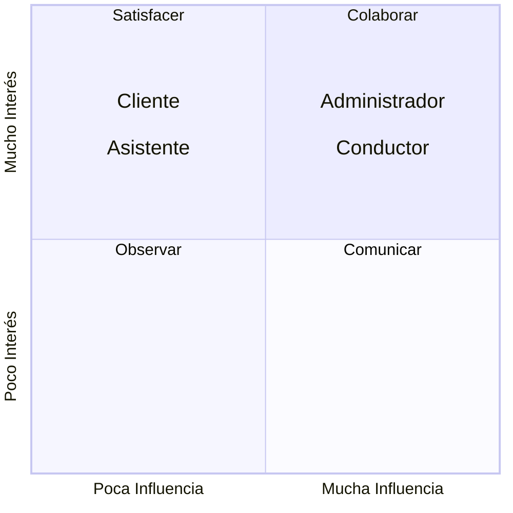

[REGRESAR](../../README.md)

# Stakeholders vs CDU

## Cliente

| Objetivos                      | Nivel de interés | Nivel de Influencia | Acciones Posibles de Impacto Positivo             | Acciones Posibles de Impacto Negativo        | Estrategias                                                    |
|--------------------------------|------------------|---------------------|---------------------------------------------------|----------------------------------------------|----------------------------------------------------------------|
| CU 001, CU 003-004, CU 017-024 | Alto             | Medio               | Adopción del nuevo sistema, proporcionar feedback | Resistencia al cambio, abandono del servicio | Incentivos para el uso del servicio, comunicación transparente |

## Asistente
| Objetivos              | Nivel de interés | Nivel de Influencia | Acciones Posibles de Impacto Positivo | Acciones Posibles de Impacto Negativo                         | Estrategias                                     |
|------------------------|------------------|---------------------|---------------------------------------|---------------------------------------------------------------|-------------------------------------------------|
| CU 007-008, CU 033-044 | Medio            | Medio               | Eficiencia en la gestión, feedback    | Falta de familiarización, inacción en resolución de problemas | Formación extensiva, retroalimentación continua |

## Conductor

| Objetivos                      | Nivel de interés | Nivel de Influencia | Acciones Posibles de Impacto Positivo           | Acciones Posibles de Impacto Negativo                                      | Estrategias                                            |
|--------------------------------|------------------|---------------------|-------------------------------------------------|----------------------------------------------------------------------------|--------------------------------------------------------|
| CU 002, CU 005-006, CU 026-032 | Alto             | Alto                | Participación activa, cumplimento de protocolos | Disminución de calidad de servicio, desinterés por seguir nuevas políticas | Capacitación adecuada, canales de comunicación abierto |

## Administrador

| Objetivos              | Nivel de interés | Nivel de Influencia | Acciones Posibles de Impacto Positivo             | Acciones Posibles de Impacto Negativo | Estrategias             |
|------------------------|------------------|---------------------|---------------------------------------------------|---------------------------------------|-------------------------|
| CU 009-010, CU 045-050 | Alto             | Alto                | Monitoreo y evaluación, comunicación transparente | Mala gestión del cambio               | Planificación cuidadosa |

[REGRESAR](../../README.md)