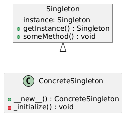
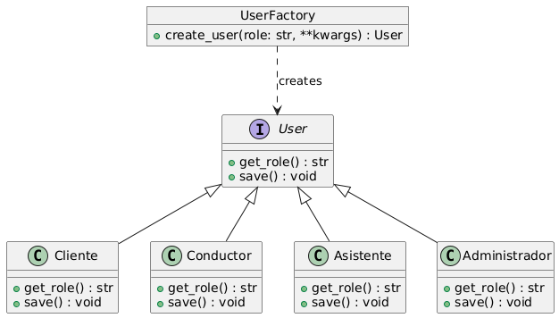
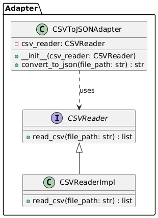
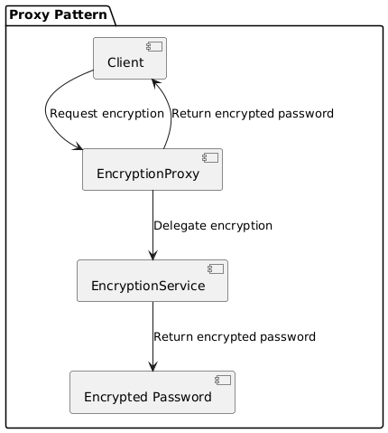
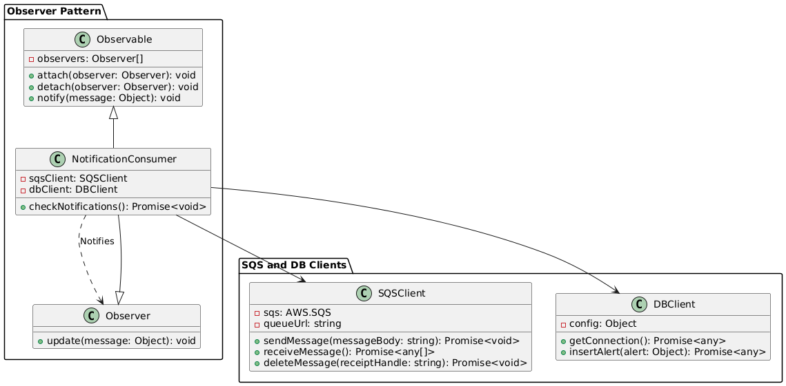

[REGRESAR](../../README.md)

#   PATRONES DE DISEÑO IMPLEMENTADOS

##  Singleton

-   Se utilizará el patrón Singleton para la gestión de la conexión con la base de datos

##  Factory Method

-   El patrón factory method nos funciona para la creación de los diferentes tipos de rol de usuario dentro del sistema.

##  Adapter

-   El patrón adapter nos sirve para convertir un archivo CSV a JSON en el caso de las tarifas que son fijas, estas serán ingresadas por medio de un archivo CSV y se almacenará su contenido en una tabla temporal de la base de datos.

##  Proxy

-   El patrón proxy nos servirá como una capa extra de seguridad al momento de encriptar las contraseñas.

##  Observer

-   El patrón observer será el encargado de gestionar las notificaciones, estará apoyado de un sistema de colas de mensajes utilizando el servicio de AWS SQS.

[REGRESAR](../../README.md)